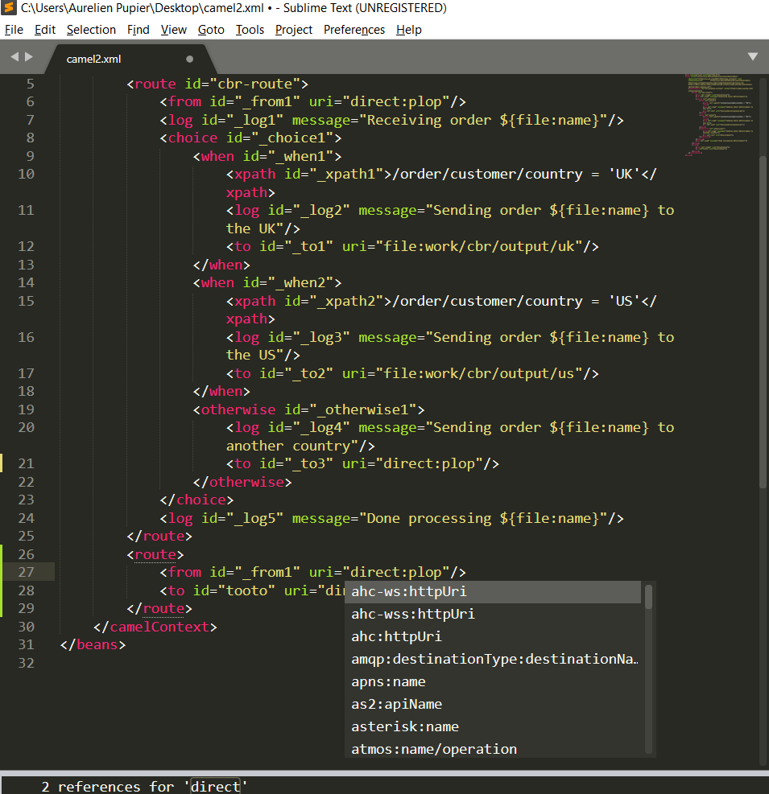

# Camel LSP client for Sublime

The idea is to leverage the [Sublime LSP package](https://github.com/tomv564/LSP).

## Download Sublime

Download from [SublimeText 3 page](https://www.sublimetext.com/3)

## Install LSP plugin

- Tools -> Command palette... -> Install package control...
- Tools -> Command palette... -> Install LSP

## Configure LSP plugin for Camel

- Download Camel LSP server jar from [Sonatype Maven repository](https://oss.sonatype.org/content/repositories/snapshots/com/github/camel-tooling/camel-lsp-server/1.1.0-SNAPSHOT/)
- Tools -> Command palette... -> Preferences: LSP Setting
- fill with updated path to the camel-lsp-server jar
```json
{
	"clients":
	{
		"Camel":
		{
			"command":
			[
				"java",
				"-jar",
				"PATH/TO/camel-lsp-server-1.1.0-SNAPSHOT.jar"
			],
			"enabled": true,
			"languageId": "camel",
			"scopes":
			[
				"text.xml"
			],
			"syntaxes":
			[
				"Packages/XML/XML.sublime-syntax"
			]
		}
	}
}
```

Enjoy!


## Current limitations

Please note that the support seems quite limited currently (for instance completion is working only at the beginning of Camel URI). Please open issues for spotted issues and missing features.
